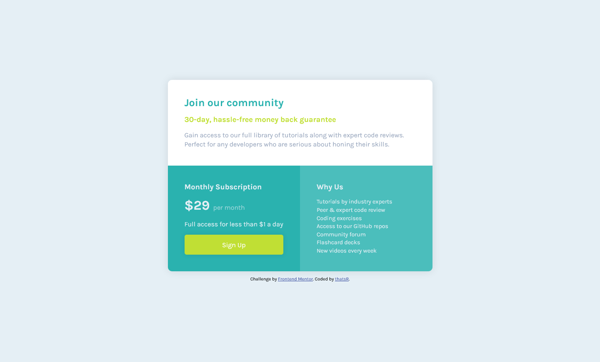

# Frontend Mentor - Product preview card component solution

This is a solution to the [Single price grid component challenge on Frontend Mentor](https://www.frontendmentor.io/challenges/single-price-grid-component-5ce41129d0ff452fec5abbbc). Frontend Mentor challenges help you improve your coding skills by building realistic projects. 

## Overview

### The challenge

Users should be able to:

- View the optimal layout for the component depending on their device's screen size
- See a hover state on desktop for the Sign Up call-to-action

### Screenshot

| desktop | mobile |
| --- | --- |
|  |  |

### Links

- Solution URL: (https://github.com/thatsR/single-price-grid-component.git)
- Live Site URL: (https://thatsr.github.io/FM-product-preview-card-component/)

## My process

### Built with

- html
- css
- flexbox
- grid

### What I learned

I learned a bit on how to make a responsive grid template. I'm also starting to get more confident with html and how I should lay things out with flexbox.

## Author

- Frontend Mentor - [@thatsR](https://www.frontendmentor.io/profile/thatsR)
